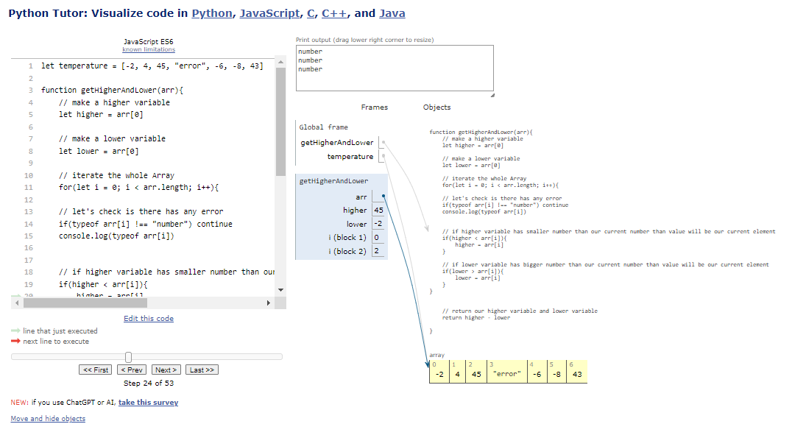

## <b>Minimum & Maximum (DSA)</b>


```javascript
function min5Log(n){
    for(let i = 0; i <= Math.min(5, n); i++){
        console.log(i)
    }
}
// min5Log(90000000000000)

// maximum
function max5Log(n){
    for(let i = 0; i <= Math.max(10, n); i++){
        console.log(i)
    }
}

max5Log(-1)

```
## Visualization (min&max)


[Visualize code](https://pythontutor.com/render.html#code=function%20min5Log%28n%29%7B%0A%20%20%20%20for%28let%20i%20%3D%200%3B%20i%20%3C%3D%20Math.min%285,%20n%29%3B%20i%2B%2B%29%7B%0A%20%20%20%20%20%20%20%20console.log%28i%29%0A%20%20%20%20%7D%0A%7D%0A//%20min5Log%2890000000000000%29%0A%0A//%20maximum%0Afunction%20max5Log%28n%29%7B%0A%20%20%20%20for%28let%20i%20%3D%200%3B%20i%20%3C%3D%20Math.max%2810,%20n%29%3B%20i%2B%2B%29%7B%0A%20%20%20%20%20%20%20%20console.log%28i%29%0A%20%20%20%20%7D%0A%7D%0A%0Amax5Log%28-1%29&cumulative=false&curInstr=0&heapPrimitives=nevernest&mode=display&origin=opt-frontend.js&py=js&rawInputLstJSON=%5B%5D&textReferences=false)


## <b>Sum Of Array (DSA)</b>


```javascript
// space complexity o(1), o(n)

function sumOfArray(arr){
    total = 0
    for(let i = 0; i < arr.length; i++){
        total = arr[i]
    }
    return total
}

// console.log(sumOfArray([25, 25, 50]))


// another example
function sumOfArray(arr){
    newArr = []
    for(let i = 0; i < arr.length; i++){
        newArr.push(arr[i] *2)
    }
    return newArr
}

console.log(sumOfArray([25, 25, 50]))

```
## Visualization (sumOfArray)


[Visualize code -(sumOfArray)](https://pythontutor.com/render.html#code=//%20space%20complexity%20o%281%29,%20o%28n%29%0A%0Afunction%20sumOfArray%28arr%29%7B%0A%20%20%20%20total%20%3D%200%0A%20%20%20%20for%28let%20i%20%3D%200%3B%20i%20%3C%20arr.length%3B%20i%2B%2B%29%7B%0A%20%20%20%20%20%20%20%20total%20%3D%20arr%5Bi%5D%0A%20%20%20%20%7D%0A%20%20%20%20return%20total%0A%7D%0A%0A//%20console.log%28sumOfArray%28%5B25,%2025,%2050%5D%29%29%0A%0A%0A%0A//%20another%20example%0Afunction%20sumOfArray%28arr%29%7B%0A%20%20%20%20newArr%20%3D%20%5B%5D%0A%20%20%20%20for%28let%20i%20%3D%200%3B%20i%20%3C%20arr.length%3B%20i%2B%2B%29%7B%0A%20%20%20%20%20%20%20%20newArr.push%28arr%5Bi%5D%20*2%29%0A%20%20%20%20%7D%0A%20%20%20%20return%20newArr%0A%7D%0A%0Aconsole.log%28sumOfArray%28%5B25,%2025,%2050%5D%29%29&cumulative=false&curInstr=0&heapPrimitives=nevernest&mode=display&origin=opt-frontend.js&py=js&rawInputLstJSON=%5B%5D&textReferences=false)


## <b>character Count (DSA)</b>


```javascript
function charCount(str){
    let charList = {}

    for (let i = 0; i < str.length; i++){
       let char = str[i].toLowerCase()

       if(charList[char] > 0){
        charList[char]++
       }else{
        charList[char] = 1
       }
    }
    return charList
}
console.table(charCount("Anower hossain"))
```

## Visualization (charCount)


[Visualize code -(charCount)](https://pythontutor.com/render.html#code=function%20charCount%28str%29%7B%0A%20%20%20%20let%20charList%20%3D%20%7B%7D%0A%0A%20%20%20%20for%20%28let%20i%20%3D%200%3B%20i%20%3C%20str.length%3B%20i%2B%2B%29%7B%0A%20%20%20%20%20%20%20let%20char%20%3D%20str%5Bi%5D.toLowerCase%28%29%0A%0A%20%20%20%20%20%20%20if%28charList%5Bchar%5D%20%3E%200%29%7B%0A%20%20%20%20%20%20%20%20charList%5Bchar%5D%2B%2B%0A%20%20%20%20%20%20%20%7Delse%7B%0A%20%20%20%20%20%20%20%20charList%5Bchar%5D%20%3D%201%0A%20%20%20%20%20%20%20%7D%0A%20%20%20%20%7D%0A%20%20%20%20return%20charList%0A%7D%0Aconsole.table%28charCount%28%22Anower%20hossain%22%29%29&cumulative=false&curInstr=0&heapPrimitives=nevernest&mode=display&origin=opt-frontend.js&py=js&rawInputLstJSON=%5B%5D&textReferences=false)


## <b>Binary Search (DSA)</b>


```javascript
function binarySearch(arr, value){
    let start = 0
    let end = arr.length -1


    while(start <= end){
        let middle = Math.round((start + end) / 2) // use floor 

        if(arr[middle] === value) return middle

        if(value > arr[middle]){
            start = middle + 1
        }else if(value < arr[middle]){
            end = middle -1
        }


    }
    return -1
}
console.log(binarySearch([2,3,4,7,34,66], 7))

```

## Visualization (binarySearch)


[Visualize code -(binarySearch)](https://pythontutor.com/render.html#code=function%20binarySearch%28arr,%20value%29%7B%0A%20%20%20%20let%20start%20%3D%200%0A%20%20%20%20let%20end%20%3D%20arr.length%20-1%0A%0A%0A%20%20%20%20while%28start%20%3C%3D%20end%29%7B%0A%20%20%20%20%20%20%20%20let%20middle%20%3D%20Math.round%28%28start%20%2B%20end%29%20/%202%29%20//%20use%20floor%20%0A%0A%20%20%20%20%20%20%20%20if%28arr%5Bmiddle%5D%20%3D%3D%3D%20value%29%20return%20middle%0A%0A%20%20%20%20%20%20%20%20if%28value%20%3E%20arr%5Bmiddle%5D%29%7B%0A%20%20%20%20%20%20%20%20%20%20%20%20start%20%3D%20middle%20%2B%201%0A%20%20%20%20%20%20%20%20%7Delse%20if%28value%20%3C%20arr%5Bmiddle%5D%29%7B%0A%20%20%20%20%20%20%20%20%20%20%20%20end%20%3D%20middle%20-1%0A%20%20%20%20%20%20%20%20%7D%0A%0A%0A%20%20%20%20%7D%0A%20%20%20%20return%20-1%0A%7D%0Aconsole.log%28binarySearch%28%5B2,3,4,7,34,66%5D,%207%29%29&cumulative=false&curInstr=0&heapPrimitives=nevernest&mode=display&origin=opt-frontend.js&py=js&rawInputLstJSON=%5B%5D&textReferences=false)


## <b> Recursion (DSA)</b>


```javascript

function countDown(n){
    // normal method
    // for(let i = n; i > 0; i--){
    //     console.log(i)
    // }
    // Recursin methods
    console.log(n)
    n-- 
    if(n > 0) {
        countDown(n)
    }
}
// countDown(10)


//Another example
function sumOfNumber(n){
    let sum = 0
    for(let i = n; i >= 0; i--){
        sum += i
    }
    return sum
}

// console.log(sumOfNumber(10))

//Recursion 
function sumOfNumberRe(n){
    if(n < 0)return 0
    

    return n + sumOfNumberRe(n - 1)
}

console.log(sumOfNumberRe(10))

/*
Operation
============
10 + 9
19 + 8
27 + 7
34 + 6
40 + 5
45 + 4
49 + 3
52 + 2
54 + 1
55 + 0

finel result = 55
*/

```

## Visualization (recursion)


[Visualize code -(recursion)](https://pythontutor.com/render.html#code=function%20countDown%28n%29%7B%0A%20%20%20%20//%20normal%20method%0A%20%20%20%20//%20for%28let%20i%20%3D%20n%3B%20i%20%3E%200%3B%20i--%29%7B%0A%20%20%20%20//%20%20%20%20%20console.log%28i%29%0A%20%20%20%20//%20%7D%0A%20%20%20%20//%20Recursin%20methods%0A%20%20%20%20console.log%28n%29%0A%20%20%20%20n--%20%0A%20%20%20%20if%28n%20%3E%200%29%20%7B%0A%20%20%20%20%20%20%20%20countDown%28n%29%0A%20%20%20%20%7D%0A%7D%0A//%20countDown%2810%29%0A%0A%0A//Another%20example%0Afunction%20sumOfNumber%28n%29%7B%0A%20%20%20%20let%20sum%20%3D%200%0A%20%20%20%20for%28let%20i%20%3D%20n%3B%20i%20%3E%3D%200%3B%20i--%29%7B%0A%20%20%20%20%20%20%20%20sum%20%2B%3D%20i%0A%20%20%20%20%7D%0A%20%20%20%20return%20sum%0A%7D%0A%0A//%20console.log%28sumOfNumber%2810%29%29%0A%0A//Recursion%20%0Afunction%20sumOfNumberRe%28n%29%7B%0A%20%20%20%20if%28n%20%3C%200%29return%200%0A%20%20%20%20%0A%0A%20%20%20%20return%20n%20%2B%20sumOfNumberRe%28n%20-%201%29%0A%7D%0A%0Aconsole.log%28sumOfNumberRe%2810%29%29%0A%0A/*%0AOperation%0A%3D%3D%3D%3D%3D%3D%3D%3D%3D%3D%3D%3D%0A10%20%2B%209%0A19%20%2B%208%0A27%20%2B%207%0A34%20%2B%206%0A40%20%2B%205%0A45%20%2B%204%0A49%20%2B%203%0A52%20%2B%202%0A54%20%2B%201%0A55%20%2B%200%0A%0Afinel%20result%20%3D%2055%0A*/&cumulative=false&curInstr=0&heapPrimitives=nevernest&mode=display&origin=opt-frontend.js&py=js&rawInputLstJSON=%5B%5D&textReferences=false)


## <b> Proble Solving(DSA)</b>


```javascript
let temperature = [-2, 4, 45, "error", -6, -8, 43]

function getHigherAndLower(arr){
    // make a higher variable
    let higher = arr[0]
    
    // make a lower variable
    let lower = arr[0]

    // iterate the whole Array
    for(let i = 0; i < arr.length; i++){
    
    // let's check is there has any error
    if(typeof arr[i] !== "number") continue 
    console.log(typeof arr[i])


    // if higher variable has smaller number than our current number than value will be our current element
    if(higher < arr[i]){
        higher = arr[i]
    }
    
    // if lower variable has bigger number than our current number than value will be our current element
    if(lower > arr[i]){
        lower = arr[i]
    }
}
    
    
    // return our higher variable and lower variable
    return higher - lower

}

// getHigherAndLower([3, 5, -9])
// getHigherAndLower(temperature)


console.log(getHigherAndLower(temperature))

```

## Visualization (problesolving)


[Visualize code -(problesolving)](https://pythontutor.com/render.html#code=let%20temperature%20%3D%20%5B-2,%204,%2045,%20%22error%22,%20-6,%20-8,%2043%5D%0A%0Afunction%20getHigherAndLower%28arr%29%7B%0A%20%20%20%20//%20make%20a%20higher%20variable%0A%20%20%20%20let%20higher%20%3D%20arr%5B0%5D%0A%20%20%20%20%0A%20%20%20%20//%20make%20a%20lower%20variable%0A%20%20%20%20let%20lower%20%3D%20arr%5B0%5D%0A%0A%20%20%20%20//%20iterate%20the%20whole%20Array%0A%20%20%20%20for%28let%20i%20%3D%200%3B%20i%20%3C%20arr.length%3B%20i%2B%2B%29%7B%0A%20%20%20%20%0A%20%20%20%20//%20let's%20check%20is%20there%20has%20any%20error%0A%20%20%20%20if%28typeof%20arr%5Bi%5D%20!%3D%3D%20%22number%22%29%20continue%20%0A%20%20%20%20console.log%28typeof%20arr%5Bi%5D%29%0A%0A%0A%20%20%20%20//%20if%20higher%20variable%20has%20smaller%20number%20than%20our%20current%20number%20than%20value%20will%20be%20our%20current%20element%0A%20%20%20%20if%28higher%20%3C%20arr%5Bi%5D%29%7B%0A%20%20%20%20%20%20%20%20higher%20%3D%20arr%5Bi%5D%0A%20%20%20%20%7D%0A%20%20%20%20%0A%20%20%20%20//%20if%20lower%20variable%20has%20bigger%20number%20than%20our%20current%20number%20than%20value%20will%20be%20our%20current%20element%0A%20%20%20%20if%28lower%20%3E%20arr%5Bi%5D%29%7B%0A%20%20%20%20%20%20%20%20lower%20%3D%20arr%5Bi%5D%0A%20%20%20%20%7D%0A%7D%0A%20%20%20%20%0A%20%20%20%20%0A%20%20%20%20//%20return%20our%20higher%20variable%20and%20lower%20variable%0A%20%20%20%20return%20higher%20-%20lower%0A%0A%7D%0A%0A//%20getHigherAndLower%28%5B3,%205,%20-9%5D%29%0A//%20getHigherAndLower%28temperature%29%0A%0A%0Aconsole.log%28getHigherAndLower%28temperature%29%29&cumulative=false&curInstr=0&heapPrimitives=nevernest&mode=display&origin=opt-frontend.js&py=js&rawInputLstJSON=%5B%5D&textReferences=false)


## <b>Analyze BigO (DSA)</b>


```javascript
function uniqueName(arr){

    let uniqueName = []
    for(let i = 0; i < arr.length; i++){
        let ele = arr[i]
        if(!uniqueName.includes(ele)){
            uniqueName.push(ele)
        }
    }
    return uniqueName
}


let nameArray = ['anower', 'shanto', 'rohan', 'rohan']
console.log(uniqueName(nameArray)) 

```

## Visualization (analyzeBigO)


[Visualize code -(analyzeBigO)](https://pythontutor.com/render.html#code=function%20uniqueName%28arr%29%7B%0A%0A%20%20%20%20let%20uniqueName%20%3D%20%5B%5D%0A%20%20%20%20for%28let%20i%20%3D%200%3B%20i%20%3C%20arr.length%3B%20i%2B%2B%29%7B%0A%20%20%20%20%20%20%20%20let%20ele%20%3D%20arr%5Bi%5D%0A%20%20%20%20%20%20%20%20if%28!uniqueName.includes%28ele%29%29%7B%0A%20%20%20%20%20%20%20%20%20%20%20%20uniqueName.push%28ele%29%0A%20%20%20%20%20%20%20%20%7D%0A%20%20%20%20%7D%0A%20%20%20%20return%20uniqueName%0A%7D%0A%0A%0Alet%20nameArray%20%3D%20%5B'anower',%20'shanto',%20'rohan',%20'rohan'%5D%0Aconsole.log%28uniqueName%28nameArray%29%29&cumulative=false&curInstr=0&heapPrimitives=nevernest&mode=display&origin=opt-frontend.js&py=js&rawInputLstJSON=%5B%5D&textReferences=false)


## <b> Bubble Sort(DSA)</b>


```javascript
// bubble Sort implementation

function bubbleSort(arr){
    let isSwap
    for(let i = 0; i < arr.length; i++){
        isSwap = false
        for(let j = 0; j < arr.length -i -1; j++){
        console.log("Swap = ", arr, arr[j], arr[j+1])
        if(arr[j] > arr[j+1]){
            let temp = arr[j]
            arr[j] = arr[j+1]
            arr[j+1] = temp
            isSwap = true
           }
        }
        if(!isSwap) break
    }
    return arr
}

console.log(bubbleSort([2, 53, 23, 1, -3]))

```

## Visualization (bubbleSort)


[Visualize code -(bubbleSort)](https://pythontutor.com/render.html#code=//%20bubble%20Sort%20implementation%0A%0Afunction%20bubbleSort%28arr%29%7B%0A%20%20%20%20let%20isSwap%0A%20%20%20%20for%28let%20i%20%3D%200%3B%20i%20%3C%20arr.length%3B%20i%2B%2B%29%7B%0A%20%20%20%20%20%20%20%20isSwap%20%3D%20false%0A%20%20%20%20%20%20%20%20for%28let%20j%20%3D%200%3B%20j%20%3C%20arr.length%20-i%20-1%3B%20j%2B%2B%29%7B%0A%20%20%20%20%20%20%20%20console.log%28%22Swap%20%3D%20%22,%20arr,%20arr%5Bj%5D,%20arr%5Bj%2B1%5D%29%0A%20%20%20%20%20%20%20%20if%28arr%5Bj%5D%20%3E%20arr%5Bj%2B1%5D%29%7B%0A%20%20%20%20%20%20%20%20%20%20%20%20let%20temp%20%3D%20arr%5Bj%5D%0A%20%20%20%20%20%20%20%20%20%20%20%20arr%5Bj%5D%20%3D%20arr%5Bj%2B1%5D%0A%20%20%20%20%20%20%20%20%20%20%20%20arr%5Bj%2B1%5D%20%3D%20temp%0A%20%20%20%20%20%20%20%20%20%20%20%20isSwap%20%3D%20true%0A%20%20%20%20%20%20%20%20%20%20%20%7D%0A%20%20%20%20%20%20%20%20%7D%0A%20%20%20%20%20%20%20%20if%28!isSwap%29%20break%0A%20%20%20%20%7D%0A%20%20%20%20return%20arr%0A%7D%0A%0Aconsole.log%28bubbleSort%28%5B2,%2053,%2023,%201,%20-3%5D%29%29&cumulative=false&curInstr=0&heapPrimitives=nevernest&mode=display&origin=opt-frontend.js&py=js&rawInputLstJSON=%5B%5D&textReferences=false)

## <b> Linear Search (DSA)</b>


```javascript


```

## Visualization (linearSearch)


[Visualize code -(linearSearch)](https://pythontutor.com/render.html#code=function%20linearSearch%28arr,%20value%29%7B%0A%20%20%20%20for%28let%20i%20%3D%200%3B%20i%20%3C%20arr.length%3B%20i%2B%2B%29%7B%0A%20%20%20%20%20%20%20%20if%28arr%5Bi%5D%20%3D%3D%20value%29%20return%20i%0A%20%20%20%20%7D%0A%20%20%20%20return%20-1%0A%7D%0A%0Aconsole.log%28linearSearch%28%5B2,3,4,5,6%5D,%205%29%29%0A//%20console.log%28linearSearch%28%5B%22anower%22,%20%22shanto%22,%20%22sajib%22,%20%22rohan%22%5D,%22anower%22%29%29&cumulative=false&curInstr=0&heapPrimitives=nevernest&mode=display&origin=opt-frontend.js&py=js&rawInputLstJSON=%5B%5D&textReferences=false)


## <b> Helper Function(DSA)</b>


```javascript
// statement 
// find the odd number and push empty array

function findOddNumber(arr){

    let result = []
    function helper(input){
        if(input.length === 0) return

        if(input[0] % 2 !== 0){
            result.push(input[0])
        }

        helper(input.slice(1))
    }

    helper(arr)

    return result //if someone say find length just add (result.length)
}

console.log(findOddNumber([2,3,56,8, 3, 6, 8, 5]))

```

## Visualization (helperFunction)


[Visualize code -(helperFunction)](https://pythontutor.com/render.html#code=//%20statement%20%0A//%20find%20the%20odd%20number%20and%20push%20empty%20array%0A%0Afunction%20findOddNumber%28arr%29%7B%0A%0A%20%20%20%20let%20result%20%3D%20%5B%5D%0A%20%20%20%20function%20helper%28input%29%7B%0A%20%20%20%20%20%20%20%20if%28input.length%20%3D%3D%3D%200%29%20return%0A%0A%20%20%20%20%20%20%20%20if%28input%5B0%5D%20%25%202%20!%3D%3D%200%29%7B%0A%20%20%20%20%20%20%20%20%20%20%20%20result.push%28input%5B0%5D%29%0A%20%20%20%20%20%20%20%20%7D%0A%0A%20%20%20%20%20%20%20%20helper%28input.slice%281%29%29%0A%20%20%20%20%7D%0A%0A%20%20%20%20helper%28arr%29%0A%0A%20%20%20%20return%20result%20//if%20someone%20say%20find%20length%20just%20add%20%28result.length%29%0A%7D%0A%0Aconsole.log%28findOddNumber%28%5B2,3,56,8,%203,%206,%208,%205%5D%29%29&cumulative=false&curInstr=0&heapPrimitives=nevernest&mode=display&origin=opt-frontend.js&py=js&rawInputLstJSON=%5B%5D&textReferences=false)


